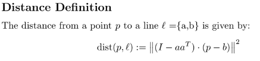

# EPOCH

This is our Final Submission for EPOCH 2024 Hackathon Problem Statement 4

# Proposed Solution

## Overview

The proposed solution aims to segment a set of datapoints into k regions and find optimized lines for each cluster. This process involves two main steps: data segregation using agglomerative clustering and line optimization through self regression model.

## Steps

### Data Segregation using Agglomerative Clustering

1. Given k as the number of lines to be laid down, the first step involves segregating the datapoints into k regions.
2. Agglomerative clustering, a hierarchical clustering technique, is employed for this purpose.
3. This method starts by considering each data point as a separate cluster and then iteratively merges the closest pairs of clusters until K clusters are formed.

#### Reasons to Use Agglomerative Clustering

Agglomerative clustering is chosen for data segregation due to the following reasons:

-   **Hierarchical Nature**: Agglomerative clustering creates a hierarchy of clusters, which can be useful for understanding the data structure at different levels of granularity.
-   **Flexibility**: It allows for the incorporation of various distance metrics and linkage criteria, making it adaptable to different types of data and clustering objectives.
-   **Ease of Implementation**: Agglomerative clustering is relatively straightforward to implement and interpret, making it suitable for prototyping and exploratory data analysis tasks.

### Cluster Optimization for Line Placement

1. Once the data is segmented into k clusters, the next step is to find the optimal line for each cluster.
2. A self regression model is employed for this optimization process.
3. Equally spaced points are selected on the plane of points, denoted as b.
4. For each of these points, the line is rotated around it to explore various orientations.
5. Subsequently, the cost of each line is calculated.

### Cost Calculation and Line Selection

1. The cost of each line configuration is determined based on predefined criteria
   

2. The line configuration that yields the minimum cost among all possibilities is selected as the target line for the respective cluster.

## Conclusion

This approach ensures that each cluster is associated with an optimized line placement, facilitating effective data representation or separation based on the problem requirements.
